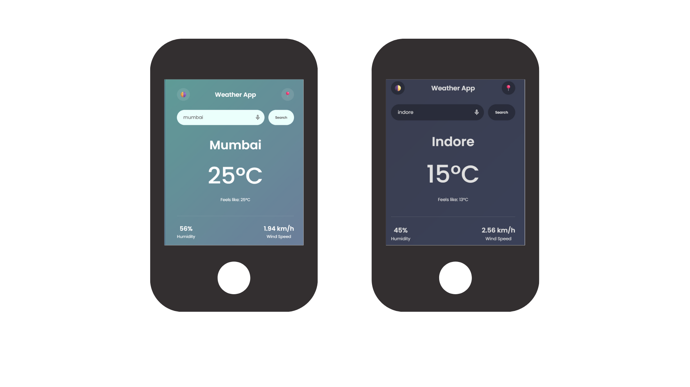

# 🌦️ Modern Weather App with Voice Search:(v2.0)

 

A sleek, responsive Weather Application built with OpenWeatherMap API. It features a modern Glassmorphism UI, real-time data fetching, and an intuitive Voice Search capability.

## 🚀 Live Demo

Experience the app live:  
**[Check Live Weather](https://kpporwal.github.io/Weather-App/)**

## 📸 New Professional UI

## ✨ Key Features (Updated)

Real-time Weather Data: Get accurate temperature, humidity, and wind speed for any city globally.

🎙️ Smart Voice Search: Integrated Web Speech API that allows users to search by voice. Includes custom logic to automatically remove trailing periods (dots) for error-free API calls.

📍 Geolocation Support: One-tap access to local weather using the browser's GPS.

🌗 Dynamic Dark Mode: Seamlessly toggle between Light and Dark themes.

📱 Mobile-First Design: Fully responsive layout for Mobile, Tablet, and Desktop.

    Glassmorphism UI: High-quality aesthetic using backdrop filters and blur effects.

## 🛠️ Tech Stack

Frontend: HTML5, CSS3 (Flexbox, CSS Variables), JavaScript (ES6+)
Icons: Google Material Symbols & Emojis
API: OpenWeatherMap API
Voice Engine: Web Speech Recognition API

## 📈 Recent Activity

This project has gained amazing traction recently:

- **85 Clones** in the last two weeks.
- **63 Unique Visitors** exploring the codebase.
- Reached a peak of **40 clones in a single day**!

---

### ⭐ Support My Work

If you like this project or find it useful for your learning, please give it a **Star** ⭐️. It helps other developers find this project and keeps me motivated to build more!
